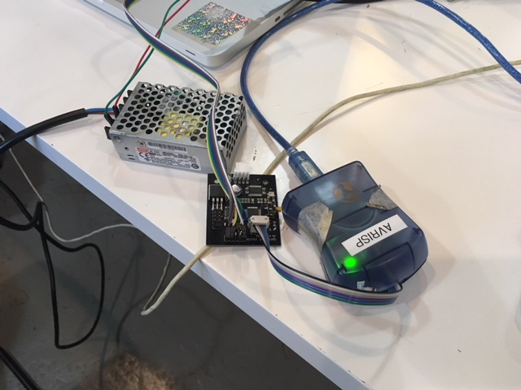

# 086-005

Gestalt Single Stepper Node Firmware

## Introduction

This is the firware the Single Node board used in the Gestalt project by Ilan and Nadya. Which is nice. In this repository you will find files needed to program your Gestalt Single Stepper Node. You can find the files for PCB production in the [board](board) folder of this repository. Pick your revision (e.g. `rev0.4`) and make your own board!

## Installation

This repository contains [Makefile](Makefile) which is used by `make` to do the following.

1. Burn the firmware
2. Set the fuses

At the moment it is configured to use the **AVRISP mkII**. To make it work with FabISP or other AVR programmer, a lot of people will be happy if you add your custom code and make a pull request.

**First** make sure that your AVR programmer is connected. There are many ways to do it, I used `lsusb` on a MacOS system.

```
lsusb
```

The following is what I got in the list.

```
Atmel Corporation AVRISP mkII
```

Which is exactly what I need to proceed. We assume that things like `avrdude` or [CrossPack](https://www.obdev.at/products/crosspack/index.html) are already installed.

**Second**, make sure your Gestalt Node is properly connected to a power source, FTDI and AVR programmer.



At this point you can use `make` to burn the firmware.

```
make program-avrisp2
```

You should see output with things that look like progress bars and a polite **Thank you!** at the end. 

**Third** make sure that you set the fuses. For that you have to use `make` once more.

```
make program-avrisp2-fuses
```

It might ask you to reset a fuse on the way, **just hit ENTER** unless you know what you are doing.

**Congratulations!** Your Gestalt Node is ready to be used. Now go to the [pygestalt](https://github.com/nadya/pygestalt) repository and continue from there.

## Contributing

Please add anything weird to the issue tracker of this repository. If you see how you can improve things directly, submit a pull request.

Thank you!


